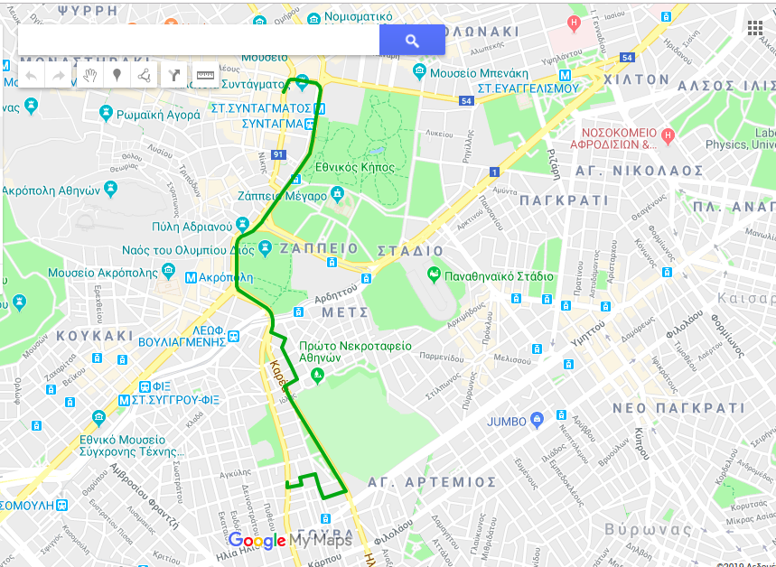

## A smart taxi navigation system -- A* Algorithm -- Java -- Prolog
:computer:Run on terminal:
```
cp -R data/. java/
cp -R prolog/. java/
cd java
java Proj client.csv taxis.csv nodes.csv lines.csv traffic.csv
```
   
:heavy_check_mark: [Jiprolog](https://github.com/jiprolog/jiprolog/releases/download/4.1.4.1/JIProlog-4.1.4.1.zip) was used to integrate Java and Prolog  

## The Team    
:oncoming_taxi: [Andreas Kontogiannis](https://github.com/ddaedalus)   
:oncoming_taxi: [Panagiotis Peppas](https://github.com/TakisPep)   
          
## About
A smart taxi navigation system developed in Java and Prolog (Jiprolog was used to integrate Java and Prolog) that uses A* AI algorithm to select the optimal taxi and optimal route from a current position to a specific destination on Google Maps. Many variables, such as road obstacles, bridges, traffic congestion, toll roads etc, were used penalized in the heuristic function.  
          
## Optimal Route displayed in Google Maps 

